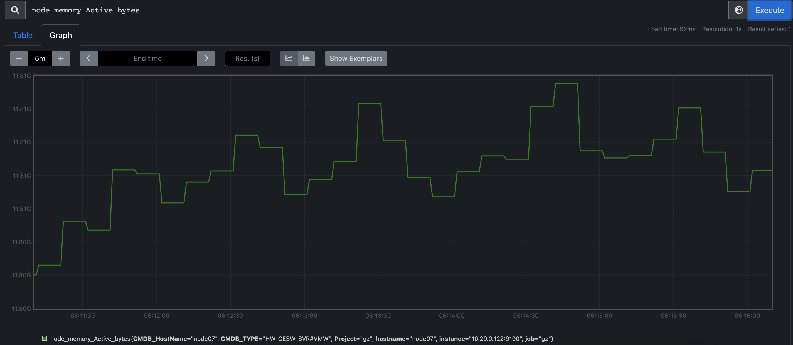

# VictoriaMetrics-基础篇
说到云原生监控方案，第一时间基本上都会想到Prometheus+AlertManager+Grafana的一套成熟解决方案。Prometheus作为监控核心，具备强大的数据模型、高效率运作、丰富的监控能力、强大的查询语言PromQL、简单易用、管理方便等特点。但是Prometheus目前在高可用层面上做的还并不完美。为此，在开源社区中，孕育出了许多替代、增强方案，VictoriaMetrics属于其中较为优异的一个，是一个快速、经济高效且可扩展的监控解决方案和时间序列数据库。
## 突出特点
1. 它可以作为Prometheus的长期储存，且支持Prometheus查询API，可以在Grafana中用作Prometheus的代替品；
2. 部署简单，无论是单节点版本还是集群版本，都只需要运行所需的组件可执行文件（每个组件都是一个可执行文件），运行前不需要安装任何依赖，易于设置和操作；
3. 使用vmbackup/vmrestore工具可以轻松快速地将即时快照备份到S3或GCS；
4. 基于PromQL的查询语言实现MetricsQL，对PromSQL进行改造；
5. 读写性能比InfluxDB和TimescaleDB高达20倍；百万时间序列数据下，内存使用比InfluxDB少10倍，比Prometheus、Thanos或Cortex少7倍；数据高压缩，与Prometheus、Thanos或Cortex相比，所需的存储空间最多可减少7倍；
6. 具有高延迟IO和低IOPS；
7. 支持从第三方时序数据库获取数据源。

### 快速接入Prometheus获取数据源
数据源接入层面，VictoriaMetrics支持通过Prometheus的远程写入方式直接兼容Prometheus的数据写入，同时也支持搜集多个Prometheus数据汇总。
```
remote_write:
  - url: http://<victoriametrics-addr>:8428/api/v1/write

# 多个proemtheus的话，需要配置每个Prometheus的标识符
global:
  external_labels:
    datacenter: dc-123
```

VictoriaMetrics还支持直接取代Prometheus进行exporter搜集。
```
使用-promscrape.config配置Prometheus的prometheus.yml
```

针对Prometheus，VictoriaMetrics进行了一些优化：
1. 增加了```extra_label=<label_name>=<label_value>```可选的查询支持，可用于基于额外标签进行查询过滤。例如```/api/v1/query_range?extra_label=user_id=123&extra_label=group_id=456&query=<query>```，会返回额外标签中包含```{user_id="123",group_id="456"}```的结果；
2. 增加了```extra_filters[]=series_selector```可选的查询支持，可用于基于拓展标签进行规则匹配的查询过滤。例如```/api/v1/query_range?extra_filters[]={env=~"prod|staging",user="xyz"}&query=<query>```，会返回额外标签中包含```{env=~"prod|staging",user="xyz"}```的结果；
3. 支持```start```和```end```，使用多种时间格式，如1562529662.678、2022-03-29T01:02:03Z、2022-03、1h5m等；
4. 在```/api/v1/query```和```/api/v1/query_range```中增加了round_digits参数，它可用于将响应值四舍五入到小数点后给定的位数；
5. 在```/api/v1/labels and /api/v1/label/<labelName>/values```中增加了limit参数，用于限制返回条目的数量；
6. 在```/api/v1/series```中增加了limit参数，用于限制返回条目的数量；
7. 新增```/api/v1/series/count```，返回数据库中时间序列的总数；
8. 新增```/api/v1/status/active_queries```，返回当前正在运行的查询列表；
9. 新增```/api/v1/status/top_queries```，返回```topByCount```最常执行的查询；返回```topByAvgDuration```平均执行持续时间最长的查询；返回```topBySumDuration```执行时间最长的查询。

除了支持Prometheus作为数据源外，VictoriaMetrics还支持其他数据源：
1. DataDog agent
2. InfluxDB-compatible agents such as Telegraf
3. Graphite-compatible agents such as StatsD
4. OpenTSDB-compatible agents
## 架构
面对获取速率低于每秒一百万个数据点的场景下，官方建议使用单节点版本而不是集群版本。单节点版本可以根据CPU内核、RAM和可用存储空间的数量完美扩展。与集群版本相比，单节点版本更易于配置和操作，因此在选择集群版本之前要三思。


VictoriaMetrics集群由以下服务组成：
1. vmstorage，存储原始数据并返回给定标签过滤器的给定时间范围内的查询数据；
2. vminsert，接受接收的数据，并根据对度量名称及其所有标签的一致哈希在vmstorage节点之间传播数据；
3. vmselect，通过从所有配置的vmstorage节点获取所需数据来执行传入查询。

每个服务可以独立扩展，并且可以在最合适的硬件上运行。vmstorage节点不了解彼此，不相互通信，也不共享任何数据。这是一个无共享架构，它提高了集群可用性，简化了集群维护和集群扩展。

VictoriaMetrics在开源层面，提供以下组件：
1. vmui：负责vm页面展示，提供数据查询、指标与基数查询、查询分析、链路分析、job分析面板等功能；
2. vmagent：负责数据采集、重新标记和过滤收集，并通过Prometheus协议将数据存储到VictoriaMetrics或其他支持Prometheus协议的存储系统中。支持按时间和标签聚合样本后同时复制多个远程存储系统，且能在传输故障时缓存数据，等待恢复后继续传输；支持抓取暴露数百万时间序列的目标与写入多个租户中；支持kafka读写；
3. vminsert：负责数据插入，支持不同格式、不同租户的数据；
4. vmstorage：负责数据存储，具有高压缩率、低资源消耗、高性能的特点；
5. vmselect：负责数据查询，支持数据统一查询与多租户数据隔离查询；
6. vmalert：负责告警，和Prometheus一样支持纪录、告警两种规则配置与发送告警通知，允许在注解中使用Go 模板来格式化数据、迭代或执行表达式，支持跨租户发送警报和记录规则；
7. vmbackup：负责数据备份，支持增量备份和全量备份，可以做到每小时、每天、每周和每月备份，支持本地存储、GCS、Azure Blob 存储、S3存储、任何与 S3 兼容的存储；
8. vmrestore：负责数据还原，支持随时中断与自动从断点恢复。
## 能力
### 保存
VictoriaMetrics使用```-retentionPeriod```命令行标志进行配置，该标志采用一个数字，后跟一个时间单位字符```-h（ours）、d（ays）、w（eeks）、y（ears）```。如果未指定时间单位，则假定为月。例如，```-retentionPeriod=3```表示数据将存储3个月，然后删除。默认保留期为一个月。
### 数据删除
VictoriaMetrics除了支持配置定时过期外，还支持手动进行数据删除操作，使用```http://<victoriametrics-addr>:8428/api/v1/admin/tsdb/delete_series?match[]=<timeseries_selector_for_delete>```。删除的时间序列的存储空间不会立即释放，而是在随后的数据文件后台合并过程中释放。请注意，对于前几个月的数据，后台合并可能永远不会发生，因此不会为历史数据释放存储空间。在这种情况下，强制合并可能有助于释放存储空间。
### 强制合并
VictoriaMetrics会在后台以每个月为一个分区的形式进行数据压缩，以保持良好的性能。可以使用```http://victoriametrics:8428/internal/force_merge?partition_prefix=YYYY_MM```进行强制数据压缩，会以异步的形式，立马返回请求结果并后台开始压缩任务的执行。当需要立即删除数据的时候，可以使用强制合并触发数据删除。
### 数据导入、导出
VictoriaMetrics支持使用专属Agent接口导入数据：
1. Prometheus remote_write API
2. DataDog ```submit metrics``` API
3. Graphite plaintext protocol
4. OpenTSDB telnet put protocol
5. OpenTSDB http ```/api/put``` protocol

支持使用VictoriaMetrics统一导入接口导入数据
1. ```/api/v1/import```，导出json格式
2. ```/api/v1/import/csv```，导出csv格式
3. ```/api/v1/import/native```，导出二进制格式

相对的，也可以使用导出接口导出数据：
1. ```/api/v1/export```，导出json格式
2. ```/api/v1/export/csv```，导出csv格式
3. ```/api/v1/export/native```，导出二进制格式

VictoriaMetrics接口侧，在导入、导出接口中，数据格式保持一致，可以直接使用导出的数据进行数据导入。
### 消除重复数据
VictoriaMetrics会根据```-dedup.minScrapeInterval```配置的值进行去重，只留下一个原始样本，保留配置周期中时间戳最大的数据。比如```-dedup.minScrapeInterval=60s```，将会保留60s间隔中最大时间戳的单个原始样本。如果时间戳一致的情况下，随机保留数据。

多个相同配置的vmagent或Prometheus实例将数据写入同一VictoriaMetrics实例，则消除重复数据可减少磁盘空间的使用。
### 存储
VictoriaMetrics将以类似MergeTree的数据结构存储时间序列数据。插入时，VictoriaMetrics累积最多1s的数据，并将其转储到磁盘上的```<-storageDataPath>/data/small/YYYY_MM/```子目录，形成具有以下名称模式的part：```rowsCount_blocksCount_minTimestamp_maxTimestamp```。每个part由两个“列”组成：值和时间戳。这些是经过排序和压缩的原始时间序列值。此外，part包含索引文件，用于在值和时间戳文件中搜索特定series。

part会定期合并为较大的part，生成的部分在```<-storageDataPath>/data/{small，big}/YYYY_MM/tmp```子目录下构造。当生成的part完成后，它将自动从tmp移动到自己的子目录，而源部分将自动删除。最终结果是，源部分被```<-storageDataPath>/data/{small，big}/YYYY_MM/```目录中的单个较大部分替换。

如果part的摘要大小超过可用磁盘空间，VictoriaMetrics不会合并部件。这可以防止合并过程中出现潜在的磁盘空间不足错误。在可用磁盘空间不足的情况下，part的数量可能会随着时间的推移而显著增加。这增加了数据查询期间的开销，因为VictoriaMetrics每次请求都需要从更多的部分读取数据。这就是为什么建议在```-storageDataPath```命令行标志指示的目录下至少有20%的可用磁盘空间。

有关合并过程的信息支持在Grafana仪表板中查看。

合并过程提高了压缩率，并使磁盘上的部件数量保持相对较低。执行合并过程的好处如下：
1. 它提高了查询性能，因为每次查询都会检查较少的部分；
2. 它减少了数据文件的数量，因为每个部分都包含固定数量的文件。

存储或是合并，都不会只保存部分part，part会以数据整体的形式，要么被全部保存成功，要么全部失败。part是不可变的。
### 监控
VictoriaMetrics在```/metrics```页面以Prometheus exposion格式导出内部度量。这些指标可以通过vmagent或Prometheus获取。或者，当```-selfScrapeInterval```命令行标志设置为持续时间大于0时，单节点VictoriaMetrics可以自抓取度量。

VictoriaMetrics在```/api/v1/status/active_queries```页面上公开当前正在运行的查询及其执行时间。

VictoriaMetrics在```/api/v1/status/top_queries```页面上公开了执行时间最长的查询。
### TSDB状态
VictoriaMetrics以类似于Prometheus的方式在```/api/v1/status/TSDB```页面返回TSDB统计信息：
1. ```topN=N```，其中N是响应数量。默认情况下，返回前10个；
2. ```date=YYYY-MM-DD```，其中YYYY-MM-DD是收集统计数据的日期。默认情况下，收集当天的统计数据；
3. ```focusLabel=LABEL_NAME```，返回seriesCountByFocusLabelValue列表中给定LABEL_NAME的时间序列数最多的标签值；
4. ```match[]=SELECTOR```，其中SELECTOR是一个任意时间序列选择器，用于在统计计算期间考虑序列。默认情况下，将考虑所有系列；
5. ```extra_label=LABEL=VALUE```，拓展标签筛选。
### 推指标
当出现无法拉去指标的场景下，VictoriaMetrics支持以Prometheus数据格式的方式，通过push模式进行指标推送：
1. ```-pushmetrics.url```，推送地址，比如```-pushmetrics.url=http://victoria-metrics:8428/api/v1/import/prometheus```；
2. ```-pushmetrics.extraLabel```，拓展标签，支持以```label="value"```的形式给push数据增加标签；
3. ```-pushmetrics.interval```，push周期，默认10s。
### 缓存
VictoriaMetrics使用各种内部缓存。在正常关机期间（例如，当VictoriaMetrics通过发送SIGINT信号停止时），这些缓存存储到<-storageDataPath>/cache目录中。缓存将在下次VictoriaMetrics启动时读取。有时需要在下次启动时删除这些缓存。这可以通过在重启VictoriaMetrics之前将reset_cache_on_startup文件放置在<-storageDataPath>/cache目录中来执行。

VictoriaMetrics使用各种内存缓存来加快数据摄取和查询性能。每种类型缓存指标可以在```/metrics```页面导出：
1. ```vm_cache_size_bytes```，实际缓存大小；
2. ```vm_cache_size_max_bytes```，缓存大小限制；
3. ```vm_cache_requests_total```，对缓存的请求数；
4. ```vm_cache_misses_total```，缓存未命中数；
5. ```vm_cache_entries```，缓存中的条目数。

支持在Grafana仪表板上查看缓存指标，面板显示了每种类型缓存的当前内存使用情况，以及缓存命中率。如果命中率接近100%，则缓存效率已经很高，不需要任何调整。
### 其他
支持众多Prometheus具备的功能，比如Prometheus的标签重写、联邦等功能
## 与Prometheus对比
优势：
1. 性能优势。在相同配置、采集压力的情况下，相比使用Prometheus，存储空间最多可减少7倍，磁盘读写峰值最多可减少3-4倍，内存使用最多减少7倍；
2. 更优秀的横向拓展、高可用方案。VictoriaMetrics集群模式，通过组件化各个能力，进行功能层面的架构解耦。由于负责读写的vmselect、vminsert组件都是无状态组件，可以灵活根据读写压力，进行组件的横向扩缩容；负责存储的vmstorage组件虽然是有状态组件，但是当存储压力增加时，同样支持横向扩容，扩容后只需要更新上下游的vmselect、vminsert组件配置并重启，即可提升VictoriaMetrics集群存储能力；采集压力的时候，可以利用扩容vmagent与vmagent的采集分组能力，进行分散压力采集；
3. 数据多租户能力。VictoriaMetrics支持把不同类型的数据分别放到不同的租户里，每个租户通过 accountID 或 accountID:projectID的形式，在请求的url里做区分。租户的数量不影响性能，主要取决于所有租户的活跃总时间序列，每个租户的数据都均匀分布在后端vmstorage存储，但是不支持跨租户进行数据查询。

缺点：
1. 没有类似Prometheus的WAL日志，突然故障可能会丢失部分数据。Prometheus在接收到数据的时候，会先把数据写入内存，定期再写入磁盘。为了防止写入磁盘前数据丢失，还会再写入内存的同时简单的写入WAL文件里，当出现故障时，就可以通过WAL快速恢复当前状态。而VictoriaMetrics则在写入过程总，使用Go的chan作为数据缓存队列，多携程实现数据处理、压缩、存储等操作，故障下存在缓存数据丢失的情况；
2. 为了保证读写的速度，丢失了部分数据精度。vmstorage组件支持配置精度保存范围（1-64，64表示不丢失），以此在数据读写过程中，提升速度。
## 安装
使用helm进行VictoriaMetrics集群模式的部署
添加chart helm仓库：
```
helm repo add vm https://victoriametrics.github.io/helm-charts/
helm repo update
```
导出配置文件，并进行部署配置：
```
helm show values vm/victoria-metrics-cluster > values.yaml
```
可以使用以下命令进行配置检查：
```
helm install victoria-metrics vm/victoria-metrics-cluster -f values.yaml -n victoria-metrics --debug --dry-run
```
根据配置文件部署victoria-metrics-cluster：
```
helm install victoria-metrics vm/victoria-metrics-cluster -f values.yaml -n victoria-metrics
```
稍等片刻helm则会机提示安装成功，查询资源可以看到都已经部署起来了

## 使用
### 直接使用VictoriaMetrics进行监控

### Prometheus平滑过度
调整victoria-metrics-victoria-metrics-cluster-vminsert的service与victoria-metrics-victoria-metrics-cluster-vmselect的service，从ClusterIP模式改成NodePort模式，提供对外访问能力。修改现有Prometheus的配置，增加：
```
remote_write:
  - url: http://IP:NodePort/insert/0/prometheus
```
把Prometheus的数据，写入VictoriaMetrics，通过VictoriaMetrics的UI地址```http://IP:NodePort/select/0/vmui```，即可查看Prometheus采集到的数据了。

(Prometheus 内存监控数据)

(VictoriaMetrics 内存监控数据)

可以看出，两者数据基本一致。

## 参考链接
+ https://docs.victoriametrics.com/