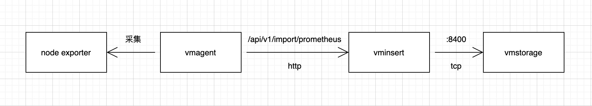

# VictoriaMetrics-源码解析数据写入过程篇

## 数据写入
以Prometheus数据写入为例子研究：

采集到的数据在聚合后，会传输给vminsert组件的```/api/v1/import/prometheus```接口，由vminsert进行数据统一处理后，会以tcp链接的形式，通过vmstorage开放的8400端口传输给vmstorage进行落盘存储。



### vminsert
1. 数据会从```/api/v1/import/prometheus```这个API进入，在```VM->app->vminsert->prometheusimport->request_handler.go->insertRows```函数中，进行数据处理，把指标名称和与之相关的label整合在了一起，作为后续区分serise的唯一标识，即node_cpu_use{id=1}与node_cpu_use{id=2}是两组数据。
```
// VM->app->vminsert->prometheusimport->request_handler.go->insertRows

...
for i := range rows {
		r := &rows[i]
		ctx.Labels = ctx.Labels[:0]
        // 按照Metric、tags、extraLabels的顺序，整理进labels数组中
		ctx.AddLabel("", r.Metric)
		for j := range r.Tags {
			tag := &r.Tags[j]
			ctx.AddLabel(tag.Key, tag.Value)
		}
		for j := range extraLabels {
			label := &extraLabels[j]
			ctx.AddLabel(label.Name, label.Value)
		}
        ...
		if err := ctx.WriteDataPoint(atLocal, ctx.Labels, r.Timestamp, r.Value); err != nil {
			return err
		}
		perTenantRows[*atLocal]++
	}
...
```

2. 使用accountID、projectID、labels信息拼接在一起，压缩信息成MetricNameBuf。
```
// VM->lib->storage->metric_name.go->MarshalMetricNameRaw

func MarshalMetricNameRaw(dst []byte, accountID, projectID uint32, labels []prompb.Label) []byte {
	// Calculate the required space for dst.
	dstLen := len(dst)
    // 申请8个字节用于存放accountID（32位uint，4个字节）、projectID（32位uint，4个字节）
	dstSize := dstLen + 8
	for i := range labels {
        ...
        // 申请存放label.Name的值的长度
		dstSize += len(label.Name)
        // 申请存放label.Value的值的长度
		dstSize += len(label.Value)
        // 申请4个长度用于存放记录label.Name长度（16位uint，2个字节，label.Name有长度限制，不会超过16位uint，超过会取前面16位uint长度内容）、记录label.Value的长度（16位uint，2个字节，label.Value有长度限制，不会超过16位uint，超过会取前面16位uint长度内容）
		dstSize += 4
	}
    // 创建所需长度的byte数组
	dst = bytesutil.ResizeWithCopyMayOverallocate(dst, dstSize)[:dstLen]

	// Marshal labels to dst.
    // 存accountID
	dst = encoding.MarshalUint32(dst, accountID)
    // 存projectID
	dst = encoding.MarshalUint32(dst, projectID)
	for i := range labels {
        ...
        // 先计算label.Name长度，存label.Name的长度（2个字节），再存label.Name的值
		dst = marshalBytesFast(dst, label.Name)
        // 先计算label.Value长度，存label.Value的长度（2个字节），再存label.Name的值
		dst = marshalBytesFast(dst, label.Value)
	}
	return dst
```

3. 采用更为简洁、类似的方式（省去了许多判断、过滤条件），使用accountID、projectID、labels信息拼接起来，利用```xxhash.Sum64```计算hash，通过hash从对接的所有storageNode中计算出对应的storageNodeIdx，找到数据需要存储的vmstorage节点编号（程序启动的时候会对每个配置对接的vmstorage节点进行编号），并对MetricNameBuf、timestamp、value再进一步压缩处理。使用ctx.bufRowss字典对象，以storageNodeIdx为key，把最终信息暂存进字典里。每个节点只存“可用内存大小/8/storageNode数”的限制长度，超过了，则会使用```ctx.bufRowss[storageNodeIdx].push```处理一次并清空继续添加。
```
// VM->lib->storage->storage.go->MarshalMetricRow

// MarshalMetricRow marshals MetricRow data to dst and returns the result.
func MarshalMetricRow(dst []byte, metricNameRaw []byte, timestamp int64, value float64) []byte {
	dst = encoding.MarshalBytes(dst, metricNameRaw)
	dst = encoding.MarshalUint64(dst, uint64(timestamp))
	dst = encoding.MarshalUint64(dst, math.Float64bits(value))
	return dst
}
```

图示标识vminsert组件对数据处理的过程：


4. vminsert会针对每一个storageNode启用一个携程，链接vmstorage的8400端口，把放进缓冲区的内容发送至vmstorage。vmstorage会默认开启8400，使用TCP的形式，接受vminsert传输过来的数据，并回复ack信号表示接受成功。如果指定的storageNode可以接受处理，则由指定的处理；如果指定的storageNode无法接受处理（离线、无响应等），则会采用轮训的方式，发给其他节点保处理。

### vmstorage

1. vmstorage组件启动默认8400端口的TCP服务器进行数据写入接收，把数据包按照“包长度（8个字节）+数据”的形式进行block拆分，把每个block放进unmarshalWorkCh缓存队列中。
```
// VM->lib->protoparser->common->unmarshal_work.go->StartUnmarshalWorkers

// readBlock reads the next data block from vminsert-initiated bc, appends it to dst and returns the result.
func readBlock(dst []byte, bc *handshake.BufferedConn, isReadOnly func() bool) ([]byte, error) {
	...
	sizeBuf.B = bytesutil.ResizeNoCopyMayOverallocate(sizeBuf.B, 8)
    // 取8个字节，表示后续的数据包长度
	if _, err := io.ReadFull(bc, sizeBuf.B); err != nil {
    ...
	}
	packetSize := encoding.UnmarshalUint64(sizeBuf.B)
  ...
	dst = bytesutil.ResizeWithCopyMayOverallocate(dst, dstLen+int(packetSize))
  // 根据之前8个字节的内容，取真正数据包长度，返回转换成数据结构体
	if n, err := io.ReadFull(bc, dst[dstLen:]); err != nil {
		readErrors.Inc()
		return dst, fmt.Errorf("cannot read packet with size %d bytes: %w; read only %d bytes", packetSize, err, n)
	}
	...
	return dst, nil
}
```

2. 根据可用cpu数量，创建work，持续消费处理unmarshalWorkCh里的数据。
```
// VM->lib->protoparser->common->unmarshal_work.go->StartUnmarshalWorkers

// StartUnmarshalWorkers starts unmarshal workers.
func StartUnmarshalWorkers() {
  ...
  // cgroup可用cpu数
	gomaxprocs := cgroup.AvailableCPUs()
	unmarshalWorkCh = make(chan UnmarshalWork, gomaxprocs)
	unmarshalWorkersWG.Add(gomaxprocs)
	for i := 0; i < gomaxprocs; i++ {
        // 利用互斥锁配合携程、chan，实现接受、处理分离
		go func() {
			defer unmarshalWorkersWG.Done()
			for uw := range unmarshalWorkCh {
				uw.Unmarshal()
			}
		}()
	}
}
```

3. 根据vminsert的buf压缩规则，解压成MetricRow数组对象。并批量进行处理数据，支持precisionBits参数，用于设置数值的保存精度。
```
// VM->app->vmstorage->servers->vminsert.go->run

func (s *VMInsertServer) run() {
	...
	err = stream.Parse(bc, func(rows []storage.MetricRow) error {
		vminsertMetricsRead.Add(len(rows))
		return s.storage.AddRows(rows, uint8(*precisionBits))
	}, s.storage.IsReadOnly)
	...
}

// MetricRow结构

type MetricRow struct {
	// MetricNameRaw contains raw metric name, which must be decoded
	// with MetricName.UnmarshalRaw.
	MetricNameRaw []byte

	Timestamp int64
	Value     float64
}
```

4. 然后对MetricRow数组对象进行处理，生成信息对应的TSID。会先比对上次操作是否是同一个MetricNameRow，是则取上次的TSID，其次是比对缓存层数据，查找同一个MetricNameRow获取TSID。都没有找到才是重新创建TSID。最后把rawRow信息存在缓存层并同时存入数据库。
```
// VM->lib->storage->storage.go->add
...
for i := range mrs {
  mr := &mrs[i]
  ...
  // 对数据的时间进行判断，只会处理比当前时间小retentionPeriod(可配置参数)到当前时间大2*24*3600*1000（+2 days）的数据
  if mr.Timestamp < minTimestamp {
    ...
  }
  if mr.Timestamp > maxTimestamp {
	...
  }
  dstMrs[j] = mr
  r := &rows[j]
  j++
  r.Timestamp = mr.Timestamp
  r.Value = mr.Value
  r.PrecisionBits = precisionBits
  // 判断是否和上一次一致，一致则获取上一次的TSID
  if string(mr.MetricNameRaw) == string(prevMetricNameRaw) {
  	r.TSID = prevTSID
		continue
  }
  //通过缓存获取，如果存在则获取缓存TSID
  if s.getTSIDFromCache(&genTSID, mr.MetricNameRaw) {
    ...
    r.TSID = genTSID.TSID
    ...
  }
  ...
  // 都不存在，先存在pmrs里面
  if err := pmrs.addRow(mr); err != nil {
    ...
  }
}
if pmrs != nil {
  ...
  for i := range pendingMetricRows {
    ...
    // 
    date := uint64(r.Timestamp) / msecPerDay
    // 生成TSID
		if err := is.GetOrCreateTSIDByName(&r.TSID, pmr.MetricName, mr.MetricNameRaw, date); err != nil {
      ...
    }
    genTSID.generation = idb.generation
		genTSID.TSID = r.TSID
    // 把生成的TSID存入缓存层
		s.putTSIDToCache(&genTSID, mr.MetricNameRaw)
		prevTSID = r.TSID
		prevMetricNameRaw = mr.MetricNameRaw
    ...
  }
}
```

5. 生成TSID逻辑，TSID的MetricGroupID为MetricName的MetricGroup的hash值，TSID的MetricID为全局MetricID+1。
```
// VM->lib->storage->tsid.go->TSID
TSID结构

type TSID struct {
	AccountID uint32
	ProjectID uint32
	MetricGroupID uint64
	JobID uint32
	InstanceID uint32
	MetricID uint64
}

// VM->lib->storage->index_db.go->generateTSID
func generateTSID(dst *TSID, mn *MetricName) {
	dst.AccountID = mn.AccountID
	dst.ProjectID = mn.ProjectID
	dst.MetricGroupID = xxhash.Sum64(mn.MetricGroup)
	if len(mn.Tags) > 0 {
		dst.JobID = uint32(xxhash.Sum64(mn.Tags[0].Value))
	}
	if len(mn.Tags) > 1 {
		dst.InstanceID = uint32(xxhash.Sum64(mn.Tags[1].Value))
	}
	dst.MetricID = generateUniqueMetricID()
}

func generateUniqueMetricID() uint64 {
	// nextUniqueMetricID + 1
	return atomic.AddUint64(&nextUniqueMetricID, 1)
}

// 初始值为时间戳
var nextUniqueMetricID = uint64(time.Now().UnixNano())
```

6. 会构建数据缓存层，用于快速查询短时间内的metricName与TSID，是否存在。由于数据量过大，为了便于快速查询，使用512个bucket对缓存数据进行分散存储。会使用xxhash.Sum64对metricName进行计算hash值，并根据bucketsCount（512个）数量，取余选择对应存储bucket，来实现快速读取、存储。

存储方法：
+ 使用chunks结构，[][]byte，来保存TSID信息二维的chunks，每一层保存几个TSID或是单独一个TSID的信息；
+ b.m[h]用于记录metricName所在的chunk层数、与层数所在的位置。
```
func (b *bucket) Set(k, v []byte, h uint64) {
	...
	// 使用前四个位置，记录key长度值占多少字符、key长度值、value长度值占多少字节、value长度值，方便后续把key、value的值取出来
	var kvLenBuf [4]byte
	kvLenBuf[0] = byte(uint16(len(k)) >> 8)
	kvLenBuf[1] = byte(len(k))
	kvLenBuf[2] = byte(uint16(len(v)) >> 8)
	kvLenBuf[3] = byte(len(v))
	// 长度信息的长度加上key、value的长度，整体就是这次信息存储的总长
	kvLen := uint64(len(kvLenBuf) + len(k) + len(v))
	if kvLen >= chunkSize {
		// Do not store too big keys and values, since they do not
		// fit a chunk.
		return
	}

	chunks := b.chunks
	needClean := false
	b.mu.Lock()
	idx := b.idx
	idxNew := idx + kvLen
	chunkIdx := idx / chunkSize
	chunkIdxNew := idxNew / chunkSize
	// 如果这次信息加上上一次信息的长度导致超过一个chunk的大小，需要新开一个chunk来额外保存新的信息
	if chunkIdxNew > chunkIdx {
		// 如果chunk全用完了，需要新的缓存chunk列表来保存新的信息，旧的chunk列表信息将会过期
		if chunkIdxNew >= uint64(len(chunks)) {
			idx = 0
			idxNew = kvLen
			chunkIdx = 0
			b.gen++
			if b.gen&((1<<genSizeBits)-1) == 0 {
				b.gen++
			}
			needClean = true
		} else {
			// idx用于记录以前缓存的数据总长，idx + kvLen 形成新的总长
			idx = chunkIdxNew * chunkSize
			idxNew = idx + kvLen
			// 使用新的chunk保存信息，向后移动当前使用的chunkIdx
			chunkIdx = chunkIdxNew
		}
		chunks[chunkIdx] = chunks[chunkIdx][:0]
	}
	// 初始化chunk
	chunk := chunks[chunkIdx]
	if chunk == nil {
		chunk = getChunk()
		chunk = chunk[:0]
	}
	// chunk装载新信息
	chunk = append(chunk, kvLenBuf[:]...)
	chunk = append(chunk, k...)
	chunk = append(chunk, v...)
	chunks[chunkIdx] = chunk
	// 使用b.m[h]记录chunkIdx，idx=chunkIdx * chunkSize + len，在idx、chunkSize已知的情况，通过整除，即可快速知道信息存在第几个chunk了。通过取余，就可以知道那层的第几个位置是他的开头了
	b.m[h] = idx | (b.gen << bucketSizeBits)
	b.idx = idxNew
	if needClean {
		b.cleanLocked()
	}
	b.mu.Unlock()
}
```

读取方法：
+ 通过b.m[h]获取metricName所在的chunk层数、与层数所在的位置；
+ 通过从开头位置向后取前四个，获取前四个位置保存的key长度值占多少字符、key长度值、value长度值占多少字节、value长度值；
+ 再以此计算出key、value长度，获取key、value。

```
func (b *bucket) Get(dst, k []byte, h uint64, returnDst bool) ([]byte, bool) {
	atomic.AddUint64(&b.getCalls, 1)
	found := false
	chunks := b.chunks
	b.mu.RLock()
	v := b.m[h]
	bGen := b.gen & ((1 << genSizeBits) - 1)
	if v > 0 {
		gen := v >> bucketSizeBits
		// 获取metricName对应的idx，
		idx := v & ((1 << bucketSizeBits) - 1)
		if gen == bGen && idx < b.idx || gen+1 == bGen && idx >= b.idx || gen == maxGen && bGen == 1 && idx >= b.idx {
			// 通过整除获取chunk层数
			chunkIdx := idx / chunkSize
			if chunkIdx >= uint64(len(chunks)) {
				// Corrupted data during the load from file. Just skip it.
				atomic.AddUint64(&b.corruptions, 1)
				goto end
			}
			chunk := chunks[chunkIdx]
			// 通过取余获取开头位置是所在层数的第几个位置
			idx %= chunkSize
			// 获取前四个位置保存的key长度值占多少字符、key长度值、value长度值占多少字节、value长度值
			if idx+4 >= chunkSize {
				// Corrupted data during the load from file. Just skip it.
				atomic.AddUint64(&b.corruptions, 1)
				goto end
			}
			kvLenBuf := chunk[idx : idx+4]
			keyLen := (uint64(kvLenBuf[0]) << 8) | uint64(kvLenBuf[1])
			valLen := (uint64(kvLenBuf[2]) << 8) | uint64(kvLenBuf[3])
			idx += 4
			// 获取key、value
			if idx+keyLen+valLen >= chunkSize {
				// Corrupted data during the load from file. Just skip it.
				atomic.AddUint64(&b.corruptions, 1)
				goto end
			}
			if string(k) == string(chunk[idx:idx+keyLen]) {
				idx += keyLen
				if returnDst {
					dst = append(dst, chunk[idx:idx+valLen]...)
				}
				found = true
			} else {
				atomic.AddUint64(&b.collisions, 1)
			}
		}
	}
	...
}
```


7. 以table数据结构在程序中存储所有数据，随后在细分成partition形式进行数据分块内存、文件持久化形式存储。

```
// VM->lib->storage->storage.go->add
func (s *Storage) add(rows []rawRow, dstMrs []*MetricRow, mrs []MetricRow, precisionBits uint8) error {
	...
	err := s.updatePerDateData(rows, dstMrs)
	if err != nil {
		err = fmt.Errorf("cannot update per-date data: %w", err)
	} else {
		// 把缓存数据，写入table对象
		err = s.tb.AddRows(rows)
		if err != nil {
			err = fmt.Errorf("cannot add rows to table: %w", err)
		}
	}
	if err != nil {
		return fmt.Errorf("error occurred during rows addition: %w", err)
	}
	return nil
}

// VM->lib->storage->table.go->AddRows
func (tb *table) AddRows(rows []rawRow) error {
	...
	// 把缓存数据，从table写入partition
	ptw.pt.AddRows(rows)
	...
}

func (pt *partition) AddRows(rows []rawRow) {
	...
	// 把缓存数据，从table写入partition
	pt.rawRows.addRows(pt, rows)
	...
}

// 使用多shard来存储数据partition，shard数量是(cgroup可用cpu+1)/2
// 尽量保证每个shard存储数据数量相等，轮询的模式
func (rrss *rawRowsShards) addRows(pt *partition, rows []rawRow) {
	shards := rrss.shards
	shardsLen := uint32(len(shards))
	for len(rows) > 0 {
		n := atomic.AddUint32(&rrss.shardIdx, 1)
		idx := n % shardsLen
		rows = shards[idx].addRows(pt, rows)
	}
}

func (rrs *rawRowsShard) addRows(pt *partition, rows []rawRow) []rawRow {
	...
	if rrb != nil {
		// 当存储数据满了一个Block，则会以一个内存part（partWrapper结构体）形式进行存储
		pt.flushRowsToParts(rrb.rows)
		putRawRowsBlock(rrb)

		// 进行合并
		flushConcurrencyCh <- struct{}{}
		pt.assistedMergeForInmemoryParts()
		pt.assistedMergeForSmallParts()
		<-flushConcurrencyCh
	}
	...
}

// partWrapper结构体
type partWrapper struct {
	refCount uint32
	mustBeDeleted uint32
	// 持久化文件存储part信息
	p *part
	// 当前内存part信息（数据）
	mp *inmemoryPart
	isInMerge bool
	flushToDiskDeadline time.Time
}

//VM->lib->storage->inmemory_part.go->NewPart
// 其中part信息会先预先使用NewPart函数，创建好后续持久化信息
func (mp *inmemoryPart) NewPart() (*part, error) {
	size := mp.size()
	return newPart(&mp.ph, "", size, mp.metaindexData.NewReader(), &mp.timestampsData, &mp.valuesData, &mp.indexData)
}

// 而其中的inmemoryPart内，存则数据，inmemoryPart结构体如下
type inmemoryPart struct {
	ph partHeader

	timestampsData bytesutil.ByteBuffer
	valuesData     bytesutil.ByteBuffer
	indexData      bytesutil.ByteBuffer
	metaindexData  bytesutil.ByteBuffer

	creationTime uint64
}

type partHeader struct {
	RowsCount uint64
	BlocksCount uint64
	MinTimestamp int64
	MaxTimestamp int64
	MinDedupInterval int64
}

//VM->lib->storage->block_stream_writer.go
// 对于raw数据，会使用block形式，对raw数据进行存储，并使用WriteExternalBlock方法进行数据字节码化，然后存储在inmemoryPart对象内

type Block struct {
	bh blockHeader
	nextIdx int
	timestamps []int64
	values     []int64
	headerData []byte
	timestampsData []byte
	valuesData []byte
}
```

8. 数据合并，存储分层三层。先把一批写入数据以内存形式存储在一个内存part里面。当有一个内存part超过一定大小，则会被合并成一个small的part，持久化存储在文件中。当一段时间内的某个small的part超过一定大小，则会被合并成一个big的part，持久化存储在文件中。
+ 内存part合并大小，以下条件取最小值：
	+ 存储量超过（10%内存大小/最大内存分区数）大小；
	+ 最大不超过1e6大小。
+ small part合并大小，以下条件取最小值：
	+ 程序可用内存大小/可用于合并的part数量；
	+ 最大不超过10e6大小；
	+ 可用磁盘大小/合并worker数量；
	+ 最大不超过big可用磁盘大小。

会先对InmemoryParts进行合并判断，后续会对SmallParts进行合并判断。
```
//VM->lib->storage->partition.go->getPartsToMerge
// 会使用这个方法，统一处理所有需要合并的数据，把他们整理成一个*partWrapper数组对象

//VM->lib->storage->partition.go->mergeParts
// 统一使用这个方法，针对*partWrapper数组对象进行数据合并处理
func (pt *partition) mergeParts(pws []*partWrapper, stopCh <-chan struct{}, isFinal bool) error {
...
	if !isDedupEnabled() && isFinal && len(pws) == 1 && pws[0].mp != nil {
		mp := pws[0].mp
		// 如果合并对象是一个，则持久化保存数据
		if err := mp.StoreToDisk(dstPartPath); err != nil {
			logger.Panicf("FATAL: cannot store in-memory part to %s: %s", dstPartPath, err)
		}
		pwNew := pt.openCreatedPart(&mp.ph, pws, nil, dstPartPath)
		pt.swapSrcWithDstParts(pws, pwNew, dstPartType)
		return nil
	}
	...
	// 合并数据
	pwNew := pt.openCreatedPart(ph, pws, mpNew, dstPartPath)
...
}

//VM->lib->storage->inmemory_part.go->StoreToDisk
// 数据存储
func (mp *inmemoryPart) StoreToDisk(path string) error {
	if err := fs.MkdirAllIfNotExist(path); err != nil {
		return fmt.Errorf("cannot create directory %q: %w", path, err)
	}
	// timestamps数据会存储在timestamps.bin文件里面
	timestampsPath := filepath.Join(path, timestampsFilename)
	if err := fs.WriteFileAndSync(timestampsPath, mp.timestampsData.B); err != nil {
		return fmt.Errorf("cannot store timestamps: %w", err)
	}
	// values数据会存储在values.bin文件里面
	valuesPath := filepath.Join(path, valuesFilename)
	if err := fs.WriteFileAndSync(valuesPath, mp.valuesData.B); err != nil {
		return fmt.Errorf("cannot store values: %w", err)
	}
	// index数据会存储在index.bin文件里面
	indexPath := filepath.Join(path, indexFilename)
	if err := fs.WriteFileAndSync(indexPath, mp.indexData.B); err != nil {
		return fmt.Errorf("cannot store index: %w", err)
	}
	// metaindex数据会存储在metaindex.bin文件里面
	metaindexPath := filepath.Join(path, metaindexFilename)
	if err := fs.WriteFileAndSync(metaindexPath, mp.metaindexData.B); err != nil {
		return fmt.Errorf("cannot store metaindex: %w", err)
	}
	// metadata数据会存储在metadata.json文件里面
	if err := mp.ph.WriteMetadata(path); err != nil {
		return fmt.Errorf("cannot store metadata: %w", err)
	}
	// Sync parent directory in order to make sure the written files remain visible after hardware reset
	parentDirPath := filepath.Dir(path)
	fs.MustSyncPath(parentDirPath)
	return nil
}

//VM->lib->storage->merge.go->mergeBlockStreamsInternal
// 使用block装载part信息，然后通过时间戳、nextIdx，把两段block合并成一段block，最后使用WriteExternalBlock方法重新构建新的inmemoryPart信息，形成新的part
```

## 结论
VictoriaMetrics的数据存储机制具有以下几个特点及优势:
1. 高效的数据压缩格式：VictoriaMetrics采用特殊设计的压缩编码格式，可以对时序数据进行高比率的压缩，减少存储空间占用，这是它的一大存储优势；
2. 数据和元数据分离：时序数据与标签、元数据分离存储，可以提供更高效的写入和查询性能，分区架构也减轻单机压力；
3. 持久化存储格式：创新的压缩编码格式同时也是一种持久化存储格式，支持数据恢复，实现存储与查询分离；
4. 运行期数据迁移：支持动态分区和数据迁移，解决大数据量下的扩容难题，可持续扩展；
5. 减少写放大问题：通过批量写入和缓存提高写性能，较好避免Prometheus中的写放大问题，降低存储负载；
6. 极简操作体验：只需要一个二进制即可运行，部署配置方便，而且资源占用少，易于大规模下的集群化部署。
总的来说，VictoriaMetrics的存储系统设计精巧，对大数据量下的时序数据库写入与存储有很多独特优化，让它可以快速可靠地运行，非常适合大规模环境下的时序数据存储与查询系统。