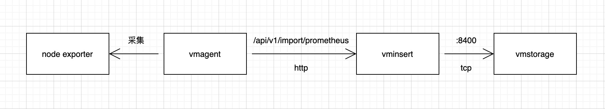
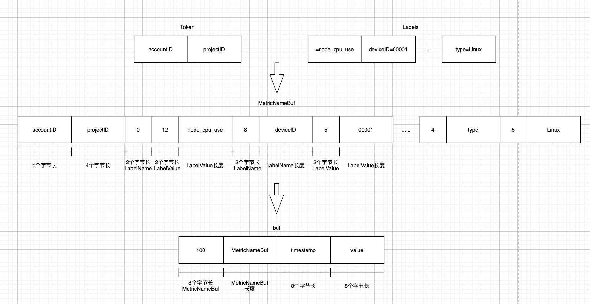

# VictoriaMetrics-读写分析篇

## 20秒看懂VictoriaMetrics读写

## 数据写入
以Prometheus数据写入为例子研究：

采集到的数据在聚合后，会传输给vminsert组件的```/api/v1/import/prometheus```接口，由vminsert进行数据统一处理后，会以tcp链接的形式，通过vmstorage开放的8400端口传输给vmstorage进行落盘存储。



### vminsert
1. 数据会从```/api/v1/import/prometheus```这个API进入，在```VM->app->vminsert->prometheusimport->request_handler.go->insertRows```函数中，进行数据处理，把指标名称和与之相关的label整合在了一起，作为后续区分serise的唯一标识，即node_cpu_use{id=1}与node_cpu_use{id=2}是两组数据。
```
// VM->app->vminsert->prometheusimport->request_handler.go->insertRows

...
for i := range rows {
		r := &rows[i]
		ctx.Labels = ctx.Labels[:0]
        // 按照Metric、tags、extraLabels的顺序，整理进labels数组中
		ctx.AddLabel("", r.Metric)
		for j := range r.Tags {
			tag := &r.Tags[j]
			ctx.AddLabel(tag.Key, tag.Value)
		}
		for j := range extraLabels {
			label := &extraLabels[j]
			ctx.AddLabel(label.Name, label.Value)
		}
        ...
		if err := ctx.WriteDataPoint(atLocal, ctx.Labels, r.Timestamp, r.Value); err != nil {
			return err
		}
		perTenantRows[*atLocal]++
	}
...
```

2. 使用accountID、projectID、labels信息拼接在一起，压缩信息成MetricNameBuf
```
// VM->lib->storage->metric_name.go->MarshalMetricNameRaw

func MarshalMetricNameRaw(dst []byte, accountID, projectID uint32, labels []prompb.Label) []byte {
	// Calculate the required space for dst.
	dstLen := len(dst)
    // 申请8个字节用于存放accountID（32位uint，4个字节）、projectID（32位uint，4个字节）
	dstSize := dstLen + 8
	for i := range labels {
        ...
        // 申请存放label.Name的值的长度
		dstSize += len(label.Name)
        // 申请存放label.Value的值的长度
		dstSize += len(label.Value)
        // 申请4个长度用于存放记录label.Name长度（16位uint，2个字节，label.Name有长度限制，不会超过16位uint，超过会取前面16位uint长度内容）、记录label.Value的长度（16位uint，2个字节，label.Value有长度限制，不会超过16位uint，超过会取前面16位uint长度内容）
		dstSize += 4
	}
    // 创建所需长度的byte数组
	dst = bytesutil.ResizeWithCopyMayOverallocate(dst, dstSize)[:dstLen]

	// Marshal labels to dst.
    // 存accountID
	dst = encoding.MarshalUint32(dst, accountID)
    // 存projectID
	dst = encoding.MarshalUint32(dst, projectID)
	for i := range labels {
        ...
        // 先计算label.Name长度，存label.Name的长度（2个字节），再存label.Name的值
		dst = marshalBytesFast(dst, label.Name)
        // 先计算label.Value长度，存label.Value的长度（2个字节），再存label.Name的值
		dst = marshalBytesFast(dst, label.Value)
	}
	return dst
```

3. 采用更为简洁、类似的方式（省去了许多判断、过滤条件），使用accountID、projectID、labels信息拼接起来，利用```xxhash.Sum64```计算hash，通过hash从对接的所有storageNode中计算出对应的storageNodeIdx，找到数据需要存储的vmstorage节点编号（程序启动的时候会对每个配置对接的vmstorage节点进行编号），并对MetricNameBuf、timestamp、value再进一步压缩处理。使用ctx.bufRowss字典对象，以storageNodeIdx为key，把最终信息暂存进字典里。每个节点只存“可用内存大小/8/storageNode数”的限制长度，超过了，则会使用```ctx.bufRowss[storageNodeIdx].push```处理一次并清空继续添加
```
// VM->lib->storage->storage.go->MarshalMetricRow

// MarshalMetricRow marshals MetricRow data to dst and returns the result.
func MarshalMetricRow(dst []byte, metricNameRaw []byte, timestamp int64, value float64) []byte {
	dst = encoding.MarshalBytes(dst, metricNameRaw)
	dst = encoding.MarshalUint64(dst, uint64(timestamp))
	dst = encoding.MarshalUint64(dst, math.Float64bits(value))
	return dst
}
```

图示标识vminsert组件对数据处理的过程


4. vminsert会针对每一个storageNode启用一个携程，链接vmstorage的8400端口，把放进缓冲区的内容发送至vmstorage。vmstorage会默认开启8400，使用TCP的形式，接受vminsert传输过来的数据，并回复ack信号表示接受成功。如果指定的storageNode可以接受处理，则由指定的处理；如果指定的storageNode无法接受处理（离线、无响应等），则会采用轮训的方式，发给其他节点保处理

5. vmstorage组件启动默认8400端口的TCP服务器进行数据写入接收，把数据包按照“包长度（8个字节）+数据”的形式进行block拆分，把每个block放进unmarshalWorkCh缓存队列中。
```
// VM->lib->protoparser->common->unmarshal_work.go->StartUnmarshalWorkers

// readBlock reads the next data block from vminsert-initiated bc, appends it to dst and returns the result.
func readBlock(dst []byte, bc *handshake.BufferedConn, isReadOnly func() bool) ([]byte, error) {
	...
	sizeBuf.B = bytesutil.ResizeNoCopyMayOverallocate(sizeBuf.B, 8)
    // 取8个字节，表示后续的数据包长度
	if _, err := io.ReadFull(bc, sizeBuf.B); err != nil {
		if err != io.EOF {
			readErrors.Inc()
			err = fmt.Errorf("cannot read packet size: %w", err)
		}
		return dst, err
	}
	packetSize := encoding.UnmarshalUint64(sizeBuf.B)
    ...
	dst = bytesutil.ResizeWithCopyMayOverallocate(dst, dstLen+int(packetSize))
    // 根据之前8个字节的内容，取真正数据包长度，返回转换成数据结构体
	if n, err := io.ReadFull(bc, dst[dstLen:]); err != nil {
		readErrors.Inc()
		return dst, fmt.Errorf("cannot read packet with size %d bytes: %w; read only %d bytes", packetSize, err, n)
	}
	...
	return dst, nil
}
```

6. 根据可用cpu数量，创建work，持续消费处理unmarshalWorkCh里的数据
```
// VM->lib->protoparser->common->unmarshal_work.go->StartUnmarshalWorkers

// StartUnmarshalWorkers starts unmarshal workers.
func StartUnmarshalWorkers() {
	if unmarshalWorkCh != nil {
		logger.Panicf("BUG: it looks like startUnmarshalWorkers() has been alread called without stopUnmarshalWorkers()")
	}
    // cgroup可用cpu数
	gomaxprocs := cgroup.AvailableCPUs()
	unmarshalWorkCh = make(chan UnmarshalWork, gomaxprocs)
	unmarshalWorkersWG.Add(gomaxprocs)
	for i := 0; i < gomaxprocs; i++ {
        // 利用互斥锁配合携程、chan，实现接受、处理分离
		go func() {
			defer unmarshalWorkersWG.Done()
			for uw := range unmarshalWorkCh {
				uw.Unmarshal()
			}
		}()
	}
}
```

7. 根据vminsert的buf压缩规则，解压成MetricRow数组对象
```
type MetricRow struct {
	// MetricNameRaw contains raw metric name, which must be decoded
	// with MetricName.UnmarshalRaw.
	MetricNameRaw []byte

	Timestamp int64
	Value     float64
}
```
8. 


### vmstorage


## 数据读取


### vmselect


### vmstorage

