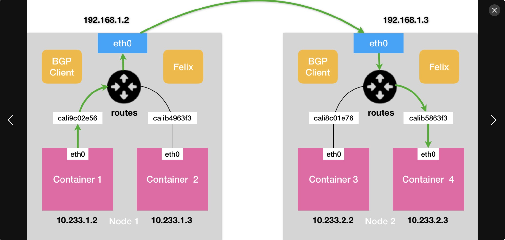
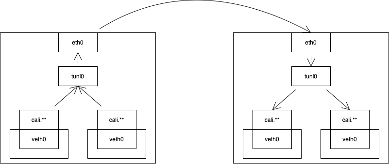
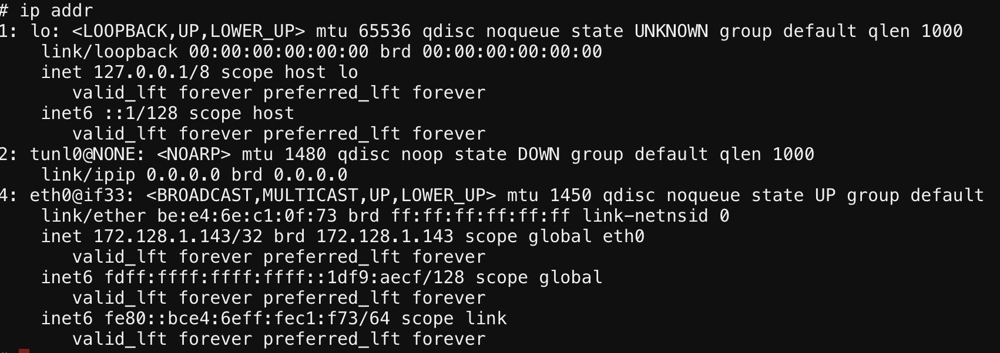
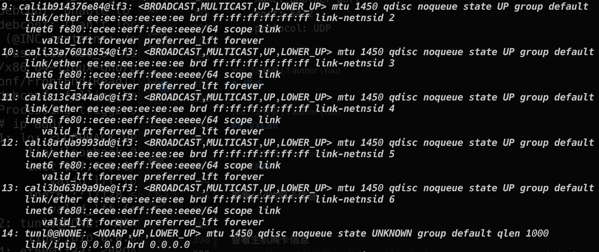
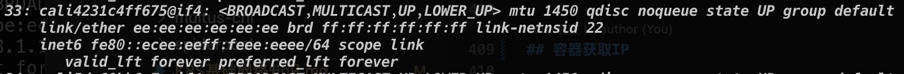

# Calico

# 介绍
Calico 是一种开源网络和网络安全解决方案，适用于容器、虚拟机和基于主机的本地工作负载。 Calico 支持广泛的平台，包括 Kubernetes、OpenShift、Mirantis Kubernetes Engine (MKE)、OpenStack 和裸机服务。

无论您选择使用 Calico 的 eBPF 数据平面还是 Linux 的标准网络管道，Calico 都能提供超快的性能和真正的云原生可扩展性。Calico 为开发人员和集群操作员提供了一致的体验和功能集，无论是在公共云中还是在本地、在单个节点上或跨数千个节点的集群中运行。

# 架构


## Calico API server
允许使用 kubectl 直接管理 Calico 资源

## Felix
主要提供路由、ACL、主机相关链接信息，并在每台节点上以守护程序形式运行。

根据具体的编排器环境，Felix 负责：

**接口管理：**

将有关接口的信息编程到内核中，以便内核可以正确处理来自该端点的流量。特别是它确保主机使用主机的 MAC 响应来自每个工作负载的 ARP 请求，并为其管理的接口启用 IP 转发。它还监视接口以确保在适当的时间应用编程。

**路由编程**

程序将其主机上的端点路由到 Linux 内核 FIB（转发信息库）中。这确保发往到达主机的那些端点的数据包被相应地转发。

**ACL编程**

将 ACL 编程到 Linux 内核中，以确保只能在端点之间发送有效流量，并且端点无法规避 Calico 安全措施。

**状态报告**

提供网络健康数据。特别是它会在配置其主机时报告错误和问题。此数据被写入数据存储，因此它对网络的其他组件和运营商可见。

## BIRD
从 Felix 获取路由并分发给网络上的 BGP 对等体，用于主机间路由。在托管 Felix 代理的每个节点上运行。

BGP 客户端负责：

**路由分发**

当 Felix 将路由插入 Linux 内核 FIB 时，BGP 客户端将它们分发到部署中的其他节点。这确保了其他部署节点的高效流量路由。

**BGP路由反射器配置**

BGP 路由反射器通常配置用于大型部署而不是标准 BGP 客户端。BGP 路由反射器充当连接 BGP 客户端的中心点。（标准 BGP 要求每个 BGP 客户端都连接到网状拓扑中的每个其他 BGP 客户端，这很难维护。）

为了实现冗余，您可以无缝部署多个 BGP 路由反射器。 BGP 路由反射器仅涉及网络控制：没有端点数据通过它们。 当 Calico BGP 客户端将路由从其 FIB 通告到路由反射器时，路由反射器将这些路由通告到部署中的其他节点。

## confd
监控 Calico 数据存储以了解 BGP 配置和全局默认值（例如 AS 编号、日志记录级别和 IPAM 信息）的更改。

Confd 根据数据存储中的数据更新动态生成 BIRD 配置文件。当配置文件改变时，confd 触发 BIRD 加载新文件。

## Dikastes
为 Istio 服务网格实施网络策略。作为 Istio Envoy 的 sidecar 代理在集群上运行。

## CNI plugin
为 Kubernetes 集群提供 Calico 网络。

提供符合Kubernetes CNI 插件 API要求的 Calico 二进制程序，程序必须安装在 Kubernetes 集群中的每个节点上。Calico CNI 插件允许您将 Calico 网络用于任何使用 CNI 网络规范的编排器上。

## Datastore plugin
通过减少每个节点对数据存储的影响来增加规模。

**Kubernetes API datastore (kdd)**

将 Kubernetes API 数据存储 (kdd) 与 Calico 一起使用的优点是：
+ 更易于管理，因为它不需要额外的数据存储；
+ 使用 Kubernetes RBAC 控制对 Calico 资源的访问；
+ 使用 Kubernetes 审计日志生成对 Calico 资源更改的审计日志。

**etcd**

etcd 是一个一致的、高可用的分布式键值存储，为 Calico 网络和组件之间的通信提供数据存储。优点是：
+ 允许您在非 Kubernetes 平台上运行 Calico；
+ Kubernetes 和 Calico 资源之间的关注点分离，例如允许您独立扩展数据存储；
+ 允许您运行包含多个 Kubernetes 集群的 Calico 集群，例如，具有 Calico 主机保护的裸机服务器与 Kubernetes 集群交互，或多个 Kubernetes 集群。

## IPAM plugin
使用 Calico 的 IP 池资源来控制如何将 IP 地址分配给集群内的 pod。

## kube-controllers
监控 Kubernetes API 并根据集群状态执行操作。

## Typha
通过减少每个节点对数据存储的影响来增加规模。作为数据存储和 Felix 实例之间的守护进程运行。默认安装，但未配置。

Typha 代表其所有客户端（如 Felix 和 confd）维护单个数据存储连接。它缓存数据存储状态并对事件进行重复数据删除，以便将它们分散到许多侦听器中。因为一个 Typha 实例可以支持数百个 Felix 实例，所以它大大降低了数据存储上的负载。并且由于 Typha 可以过滤掉与 Felix 无关的更新，因此也降低了 Felix 的 CPU 使用率。在大规模（超过 100 个节点）的 Kubernetes 集群中，这是必不可少的，因为 API 服务器生成的更新数量与节点数量成比例。

## calicoctl
用于创建、读取、更新和删除 Calico 对象的命令行界面。命令行在任何主机上都可用，可以通过网络访问二进制或容器形式的 Calico 数据存储。需要单独安装。

# 自定义资源
## BGP configuration
一个 BGP 配置资源，表示集群或特定节点的 BGP 特定配置选项。
```
apiVersion: projectcalico.org/v3
kind: BGPConfiguration
metadata:
  name: default
spec:
  logSeverityScreen: Info
  nodeToNodeMeshEnabled: true
  nodeMeshMaxRestartTime: 120s
  asNumber: 63400
  serviceClusterIPs:
    - cidr: 10.96.0.0/12
  serviceExternalIPs:
    - cidr: 104.244.42.129/32
    - cidr: 172.217.3.0/24
  listenPort: 178
  bindMode: NodeIP
  communities:
    - name: bgp-large-community
      value: 63400:300:100
  prefixAdvertisements:
    - cidr: 172.218.4.0/26
      communities:
        - bgp-large-community
        - 63400:120
```

## BGP peer
BGP 对等资源，表示远程 BGP 对等点，Calico 集群中的节点将与之对等。 配置 BGP 对等点允许您将 Calico 网络与您的数据中心结构（例如 ToR）对等
```
apiVersion: projectcalico.org/v3
kind: BGPPeer
metadata:
  name: some.name
spec:
  node: rack1-host1
  peerIP: 192.168.1.1
  asNumber: 63400
```

## Block affinity
块关联资源，表示 IPAM 块的关联。 这些由 Calico IPAM 管理。

## Calico node status
Calico 节点状态资源，表示节点的状态信息的集合，Calico 将这些信息报告回给用户，以便在故障排除期间使用。

需要注意，CalicoNodeStatus的更新将对节点的CPU/内存使用产生很小的性能影响，并增加Kubernetes apiserver的负载。
```
apiVersion: projectcalico.org/v3
kind: CalicoNodeStatus
metadata:
  name: my-caliconodestatus-1
spec:
  classes:
    - Agent
    - BGP
    - Routes
  node: my-kadm-node-0
  updatePeriodSeconds: 10
```

## Felix configuration
Felix 配置资源，表示群集的 Felix 配置选项。
```
apiVersion: projectcalico.org/v3
kind: FelixConfiguration
metadata:
  name: default
spec:
  ipv6Support: false
  ipipMTU: 1400
  chainInsertMode: Append
```

## Global network policy
全局网络策略资源，表示一组有序的规则，这些规则应用于与标签选择器匹配的端点集合。

全局网络策略资源，不是命名空间资源。 适用于所有命名空间中的工作负载端点资源，以及主机端点资源。 通过使用作为标签名称和名称作为要比较的值，在标准选择器中选择名称空间。

全局网络策略资源，资源可用于定义 Calico 端点组和主机端点组之间的网络连接规则，并优先于 Profile 资源（如果已定义）。

```
apiVersion: projectcalico.org/v3
kind: GlobalNetworkPolicy
metadata:
  name: allow-tcp-6379
spec:
  selector: role == 'database'
  types:
    - Ingress
    - Egress
  ingress:
    - action: Allow
      metadata:
        annotations:
          from: frontend
          to: database
      protocol: TCP
      source:
        selector: role == 'frontend'
      destination:
        ports:
          - 6379
  egress:
    - action: Allow
```
## Global network set
全局网络集资源，表示一组任意的 IP 子网/CIDR， 允许它与calico政策相匹配。网络集对于将策略应用于流量非常有用 来自（或将要）外部的非 Calico 网络。

每个网络集的元数据包括一组标签。 当 Calico 在全局网络策略规则中或在包含 的网络策略规则中计算应匹配源/目标选择器的 IP 集时，它包括来自与选择器匹配的任何网络集的 CIDR。

由于 Calico 根据数据包的源/目标 IP 地址匹配数据包，如果启用 Calico 的节点与网络集中列出的网络之间存在 NAT，则 Calico 规则可能不会按预期运行。 例如，在 Kubernetes 中，通过服务 IP 的传入流量通常在到达目标主机之前由 kube-proxy 进行 SNAT，因此 Calico 的工作负载策略会将 kube-proxy 的主机 IP 视为源而不是真正的源。
```
apiVersion: projectcalico.org/v3
kind: GlobalNetworkSet
metadata:
  name: a-name-for-the-set
  labels:
    role: external-database
spec:
  nets:
    - 198.51.100.0/28
    - 203.0.113.0/24
```
## Host endpoint
主机终端节点资源，表示一个或多个真实或虚拟接口 连接到运行 Calico 的主机。它执行Calico策略通过这些进入或离开主机默认网络命名空间的流量接口。
+ 主机端点表示主机的所有真实或虚拟接口。
+ 一个特定实际接口的主机端点由配置。 

```
apiVersion: projectcalico.org/v3
kind: HostEndpoint
metadata:
  name: some.name
  labels:
    type: production
spec:
  interfaceName: eth0
  node: myhost
  expectedIPs:
    - 192.168.0.1
    - 192.168.0.2
  profiles:
    - profile1
    - profile2
  ports:
    - name: some-port
      port: 1234
      protocol: TCP
    - name: another-port
      port: 5432
      protocol: UDP
```
## IP pool
IP 池资源，表示 Calico 期望从中获取的 IP 地址集合 要分配的终结点 IP。
```
apiVersion: projectcalico.org/v3
kind: IPPool
metadata:
  name: my.ippool-1
spec:
  cidr: 10.1.0.0/16
  ipipMode: CrossSubnet
  natOutgoing: true
  disabled: false
  nodeSelector: all()
  allowedUses:
    - Workload
    - Tunnel
```
## IP reservation
IP 保留资源，表示 Calico 应使用的 IP 地址集合 自动分配新 IP 地址时不使用。它仅适用于使用Calico IPAM 的情况。

```
apiVersion: projectcalico.org/v3
kind: IPReservation
metadata:
  name: my-ipreservation-1
spec:
  reservedCIDRs:
    - 192.168.2.3
    - 10.0.2.3/32
    - cafe:f00d::/123
```
## IPAM configuration
IPAM 配置资源，表示全局 IPAM 配置选项。

```
apiVersion: projectcalico.org/v3
kind: IPAMConfiguration
metadata:
  name: default
spec:
  strictAffinity: false
  maxBlocksPerHost: 4
```
## Kubernetes controllers configuration
Calico Kubernetes 控制器配置资源，表示 Calico Kubernetes 控制器的配置选项。

```
apiVersion: projectcalico.org/v3
kind: KubeControllersConfiguration
metadata:
  name: default
spec:
  logSeverityScreen: Info
  healthChecks: Enabled
  etcdv3CompactionPeriod: 10m
  prometheusMetricsPort: 9094
  controllers:
    node:
      reconcilerPeriod: 5m
      leakGracePeriod: 15m
      syncLabels: Enabled
      hostEndpoint:
        autoCreate: Disabled
    policy:
      reconcilerPeriod: 5m
    workloadEndpoint:
      reconcilerPeriod: 5m
    serviceAccount:
      reconcilerPeriod: 5m
    namespace:
      reconcilerPeriod: 5m
```

## Network policy

网络策略资源，表示应用的一组有序规则 到与标签选择器匹配的终结点集合。

NetworkPolicy是命名空间资源。 在特定命名空间中仅适用于该命名空间中的工作负载终端节点资源。如果两个资源的值设置相同，则两个资源位于同一命名空间中。

NetworkPolicy资源可用于定义 Calico 端点组和主机端点组之间的网络连接规则，以及 优先于配置文件资源（如果已定义）。

```
apiVersion: projectcalico.org/v3
kind: NetworkPolicy
metadata:
  name: allow-tcp-6379
  namespace: production
spec:
  selector: role == 'database'
  types:
    - Ingress
    - Egress
  ingress:
    - action: Allow
      metadata:
        annotations:
          from: frontend
          to: database
      protocol: TCP
      source:
        selector: role == 'frontend'
      destination:
        ports:
          - 6379
  egress:
    - action: Allow
```
## Network set

网络集资源，表示一组任意的 IP 子网/CIDR， 允许它与印花布政策相匹配。网络集对于将策略应用于流量非常有用 来自（或将要）外部的非 Calico 网络。

NetworkSet是命名空间资源。 在特定命名空间中 仅适用于该命名空间中的网络策略。如果两个资源的值设置相同，则两个资源位于同一命名空间中。

每个网络集的元数据都包含一组标注。当印花布计算集合时 应与网络策略规则中的源/目标选择器匹配的 IP，它包括 来自与选择器匹配的任何网络的 CIDR。

```
apiVersion: projectcalico.org/v3
kind: NetworkSet
metadata:
  name: external-database
  namespace: staging
  labels:
    role: db
spec:
  nets:
    - 198.51.100.0/28
    - 203.0.113.0/24
```
## Node
节点资源，表示运行 Calico 的节点。添加主机时 对于 Calico 集群，需要创建一个节点资源，其中包含 主机上运行的实例的配置。

启动实例时，提供给实例的名称应 与节点资源中配置的名称匹配。

默认情况下，启动实例会自动创建节点资源 使用计算主机的。
```
apiVersion: projectcalico.org/v3
kind: Node
metadata:
  name: node-hostname
spec:
  bgp:
    asNumber: 64512
    ipv4Address: 10.244.0.1/24
    ipv6Address: 2001:db8:85a3::8a2e:370:7334/120
    ipv4IPIPTunnelAddr: 192.168.0.1
```
## Profile
配置文件提供了一种对多个终结点进行分组的方法，以便它们继承一组共享的标签。出于历史原因，个人资料还可以包括 策略规则，但该功能已被弃用，取而代之的是更多 灵活的网络政策和全球网络政策资源。

可以将每个 Calico 端点或主机端点分配给零个或多个配置文件。
```
apiVersion: projectcalico.org/v3
kind: Profile
metadata:
  name: dev-apps
spec:
  labelsToApply:
    stage: development
```
## Workload endpoint

```
apiVersion: projectcalico.org/v3
kind: WorkloadEndpoint
metadata:
  name: node1-k8s-my--nginx--b1337a-eth0
  namespace: default
  labels:
    app: frontend
    projectcalico.org/namespace: default
    projectcalico.org/orchestrator: k8s
spec:
  node: node1
  orchestrator: k8s
  endpoint: eth0
  containerID: 1337495556942031415926535
  pod: my-nginx-b1337a
  endpoint: eth0
  interfaceName: cali0ef24ba
  mac: ca:fe:1d:52:bb:e9
  ipNetworks:
  - 192.168.0.0/32
  profiles:
  - profile1
  ports:
  - name: some-port
    port: 1234
    protocol: TCP
  - name: another-port
    port: 5432
    protocol: UDP
```

# 模式
## VXLan
VXLAN 是 linux 内核支持的一种隧道技术，通过隧道技术可以在宿主机网络上构建一个二层的虚拟网络。VXLAN 通过将二层的数据帧封装成四层的 UDP 数据包，然后在三层的网络中传输，效果就像在同一个网段中传包一样，在宿主机网络的层面看实际上是跨网段的，但却感知不到。

优点是，只要k8s节点间三层互通， 可以跨网段，对主机网关路由没有特殊要求。各个node节点通过vxlan设备实现基于三层的”二层”互通,三层即vxlan包封装在udp数据包中，要求udp在k8s节点间三层可达;层即vxlan封包的源mac地址和目的mac地址是自己的vxlan设备mac和对端vxlan设备mac。

缺点是，需要进行vxlan的数据包封包和解包会存在一定的性能损耗

VXlan网络结构图


## IPIP
把 IP 层封装到 IP 层的一个 tunnel。它的作用其实基本上就相当于一个基于IP层的网桥！一般来说，普通的网桥是基于mac层的，根本不需 IP，而这个 ipip 则是通过两端的路由做一个 tunnel，把两个本来不通的网络通过点对点连接起来。

优点是，只要k8s节点间三层互通， 可以跨网段，对主机网关路由没有特殊要求。

缺点是，需要进行vxlan的数据包封包和解包会存在一定的性能损耗

IPIP网络结构图


查看pod的网卡信息


查看主机网卡信息，可以发现主机上有非常多的网卡，除了ens224网卡外，多了很多cali****与tunl0@NONE


可以发现pod网卡eth0@if33后面有一个33的数字，主机网卡cali****前面也都有数字，通过查看主机网卡可以发现，33编号的网卡，存在且也是cali为前缀。其实eth0与33的cali4231是一对veth pair，因此cali4231接收到的ip流向一定与eth0相同。

查看主机路由表，也可以看到eth0网卡的流量会通过cali4231转发到0.0.0.0，对比之前的主机网卡的信息，0.0.0.0是tunl0。也就意味着，cali4231发出的ip流量都会经过tunl0再转发出去


### 跨节点pod通信
nginx-test-5bc89d64db-2v6pt位于node03上，nginx-test-5bc89d64db-lxtwv位于node02上，在nginx-test-5bc89d64db-2v6pt上ping nginx-test-5bc89d64db-lxtwv，在node02上对pod进行抓包，查看情况。
```
tcpdump  -i **** -nn -w icmp_ping.cap
```


### 同节点pod通信
......

## BGP
边界网关协议（Border Gateway Protocol, BGP）是互联网上一个核心的去中心化自治路由协议。它通过维护IP路由表或‘前缀’表来实现自治系统（AS）之间的可达性，属于矢量路由协议。BGP不使用传统的内部网关协议（IGP）的指标，而使用基于路径、网络策略或规则集来决定路由。因此，它更适合被称为矢量性协议，而不是路由协议。

## 参考链接
+ https://docs.tigera.io/calico/latest/about